Ethan Kusters  
CSC 431-01: Compiler Construction  
Professor Aaron Keen  
10 June 2020  


# MINIC

## Compiler Overview

### Parsing

MINIC relies on [ANTLR4](https://github.com/antlr/antlr4) for text parsing and its generated Visitor pattern to translate that initial parse into an Abstract Syntax Tree representation. The AST is represented as several enumerations. After working with [SML](https://www.smlnj.org/sml.html) in Professor Aaron Keen's [Programming Languages course](http://users.csc.calpoly.edu/~akeen/courses/csc430/) while developing an interpreter, I recognized how similar Swift's enum is to SML's datatype and was interested in continuing to work with this representation. For example, an `Expression` in my compiler is represented as the following:

```swift
enum Expression {
    
    indirect case binary(lineNumber: Int, op: BinaryOperator, left: Expression, right: Expression)
    
    indirect case dot(lineNumber: Int, left: Expression, id: String)
    
    case `false`(lineNumber: Int)
    
    case identifier(lineNumber: Int, id: String)
    
    case integer(lineNumber: Int, value: Int)
    
    indirect case invocation(lineNumber: Int, name: String, arguments: [Expression])
    
    case new(lineNumber: Int, id: String)
    
    case null(lineNumber: Int, typeIndex: Int)
    
    case read(lineNumber: Int)
    
    case `true`(lineNumber: Int)
    
    indirect case unary(lineNumber: Int, op: UnaryOperator, operand: Expression)
    
}
```

Type checking is done on this representation via a series of `switch` statements over these enumerations. Errors are represented via yet another enumeration called `TypeError` which holds specific information for the kind of type error found. This allows for the generation of user-friendly type errors:

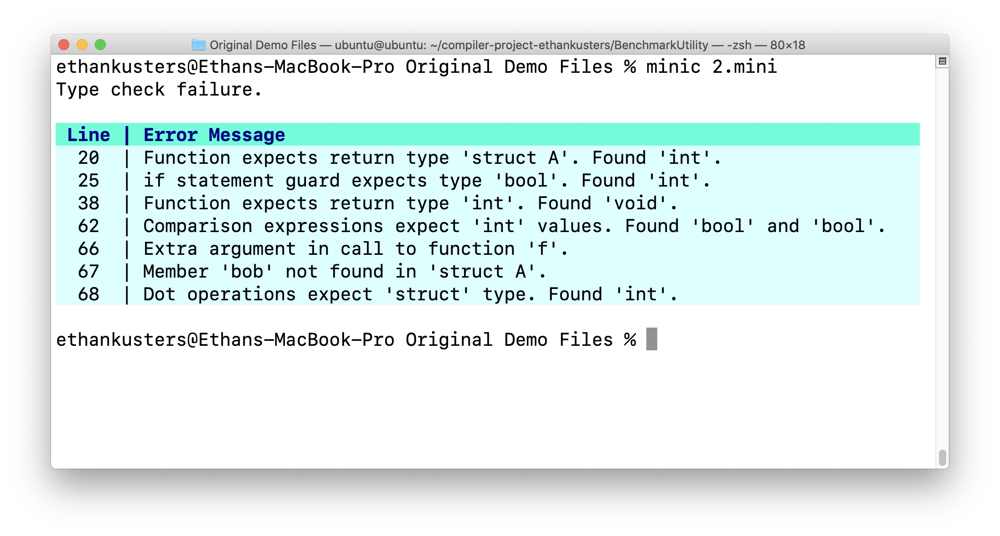

### Static Semantics

The bulk of the static type checking is done via two switch statements. One for the `Expression` enum and one for the `Statement` enum. While this type checking is performed, a `TypeContext` is passed around that holds type information for any identifiers in the program. In general I found this to be a pretty clean way to do type checking, all of the logic is kept to a couple of files that deal with the type checking. Because of the nature of enums and switch statements in Swift, if a value were ver added to `Expression`, Swift would throw a compiler error until the case was handled by the checking. That being said, enums can be a bit clunky when working with a particularly complicated case. In example, type checking binary Expressions requires a nested switch statement over the `BinaryOperator`. Because this case is so complicated, I moved type checking binary expressions into a specific function. Unfortunately, there's no way to pass a specific case of an enum to a function. This leads to some inelegant code at the top of the `typeCheckBinaryExp` function that throws an error if any case of `Expression` besides `binary` is passed to it. That being said, I think the overall benefit of localizing all type checking related code to a couple of places outweighs the bit of clunkiness produced by enumerations. 

The compiler also checks for a return statement along each possible path of the function. This is implemented via a custom enum type that is returned from `StatementTypeChecker` called `ReturnEquivalent`. If the statement type checker can determine that one path is return equivalent, it returns a value of `isReturnEquivalent`, if not it returns `notReturnEquivalent`. For example, when type checking a block statement, `typeCheck` is called on each statement within the block and the results of each of these calls is saved in an array. The compiler then confirms that this array contains at least one value of `isReturnEquivalent` and returns `isReturnEquivalent` for the block statement if so. 

```swift
case let .block(_, statements):
    let statementReturnEquivalences = statements.map(typeCheck)
    guard statementReturnEquivalences.contains(.isReturnEquivalent) else {
        return .notReturnEquivalent
    }
    
    return .isReturnEquivalent
```

At the end of the type checking process, the `TypeCheckingManager` confirms that each function has a value of `isReturnEquivalent` and raises a type error if not.

### Intermediate Representation

After the type checking process, the abstract syntax tree representation is converted to a control flow graph (CFG) containing LLVM instructions. This is an intermediate representation used prior to generating ARM Assembly for a number of reasons. While working on generating the control flow graph I wrote a tool that converts the internal CFG representation to a visualization in the [Graphviz](https://graphviz.org/about/) [DOT Language](https://graphviz.org/doc/info/lang.html):

 

The CFG is useful because it allows for analysis and modifications to code ordering without concern for breaking the flow of control. Instructions can be modified and reordered within a block without worry of effecting other blocks. This benefit is increased by using SSA Form.

MINIC constructs a Single Static Assignment (SSA) Form as [discussed by Braun, et. al.](http://compilers.cs.uni-saarland.de/papers/bbhlmz13cc.pdf). This form is used as a backbone for other optimizations as well as register allocation. Similar to the benefits of a CFG representation, SSA is useful in that it allows isolation of concern. Because each variable is only assigned to a single time, that variable can be modified or removed without worry of unintended consequences. SSA also allows for easy generation of use-definition chains, another kind of graph overlaid on top of the CFG that connects each variable to its definition and uses. 

LLVM is used because of its portability and the fact that it's easier to generate valid LLVM code than it is to generate valid ARM code. LLVM also contains a [phi instruction](https://releases.llvm.org/9.0.0/docs/LangRef.html#phi-instruction) specifically to allow for this SSA representation. Having the intermediate representation in LLVM allows for more complicated optimizations to be done on the LLVM representation and a mechanical, consistent, conversion to ARM later on in the process.

### Optimizations

MINIC's primary optimization is Sparse Conditional Constant Propagation (SCCP) as [described by Wegman and Zadeck](https://www.cse.wustl.edu/~cytron/531Pages/f11/Resources/Papers/cprop.pdf). This optimization walks through the CFG in essentially the same way it will eventually be executed and statically analyses what can be computed before execution. This is very similar to interpretation but with the added complication of mixing values that are known with those that cannot be determined until execution. As MINIC represents LLVM instructions as (yet another) enum, this static evaluation is done via a single switch statement over the LLVM instruction type.

MINIC also performs useless instruction removal which was rather trivial to implement because of work done prior to remove trivial phi statements. The SSA representation is used to determine which values have a definition but no uses, then the defining instruction for these values is removed from the program. This optimization is done after SCCP as SCCP can surface useless instructions.

### Code Generation and Register Allocation

The translation from LLVM to Assembly is intentionally rather mechanical and boring. There are definitely more efficient ways to convert certain common patterns of LLVM instructions, but the main goal was to simple produce valid ARM code and to optimize in the stages prior. The bulk of this conversion was done via extensions to the existing LLVM types that converted them to similar ARM representations. The ARM code was represented as (you guessed it) an enumeration.

One exception to this rote conversion of LLVM to ARM is the LLVM `phi` instruction, ARM does not have a phi instruction and for good reason. Part of the "magic" of the phi instruction is that all phi instructions at the top of a block are performed simultaneously. Any sort of assembly language cannot have an equivalent for such an instruction. Because of this the phi instructions are converted into a series of move instructions that make use of an added virtual register. This allows the instructions to continue to be "simultaneous" while actually occurring as sequential instructions. This translation is done prior to the conversion to ARM via a temporary (and fictional) `move` instruction in the LLVM representation. This effectively deconstructs the SSA representation as the added "phi" virtual register will be assigned to multiple times.

### Other

I am generally pretty proud of how organized I kept the codebase for this compiler. It turned into a huge project but by making heavy use of Swift's ability to add new functionality to existing enumerations and classes via extensions I was able to keep files fairly small and grouped by functionality. I wasn't that familiar with Swift's enum type before this project and I think it's safe to say I am now a little too familiar with it. I also worked to get the compiler itself to run on the Raspberry Pi so that I could run both the generated ARM code and the compiler in the same environment. This allowed the benefit of being able to benchmark compile times but also just made the complier feel more "real".

I also made use of the Swift Argument Parser that was released just a couple of months before I began work on the project. It also added to the overall polish of the finished project. 


I learned a lot working on this project and really enjoyed the challenge. 

## Benchmark Results

These benchmarks were compiled and run on a [Raspberry Pi 4 Model B](https://www.raspberrypi.org/products/raspberry-pi-4-model-b/) with 4GB of RAM running a 64-bit version of Ubuntu 18.04. 64-bit Ubuntu was used because the Swift target of ANTLR4 requires 64-bit but a [32-bit version of GCC](https://packages.debian.org/stretch/devel/gcc-arm-linux-gnueabi) was used to compile the .c version of the benchmarks to make the comparison versus the 32-bit ARM assembly generated via MINIC fair. The entire benchmark sequence was performed 5 times and an average was taken.

### [BenchMarkishTopics](./Benchmarks/BenchMarkishTopics)

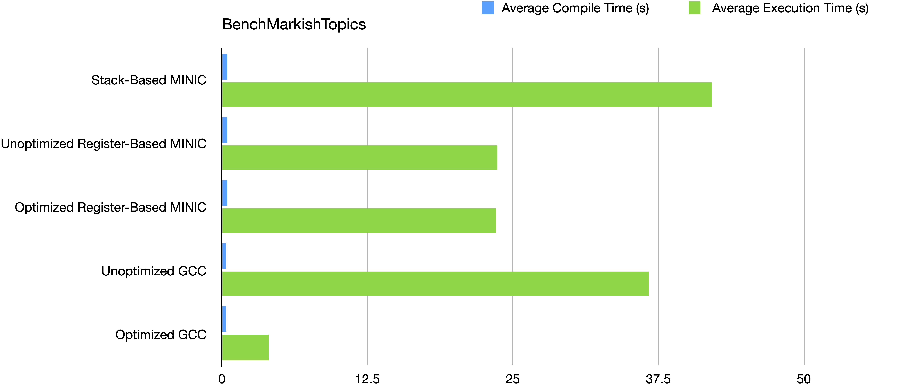

### [bert](./Benchmarks/bert)


### [biggest](./Benchmarks/biggest)

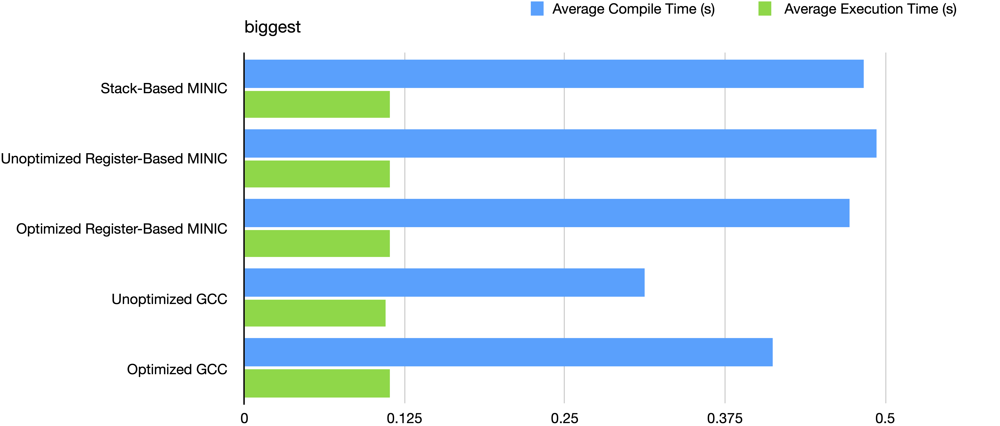

### [binaryConverter](./Benchmarks/binaryConverter)

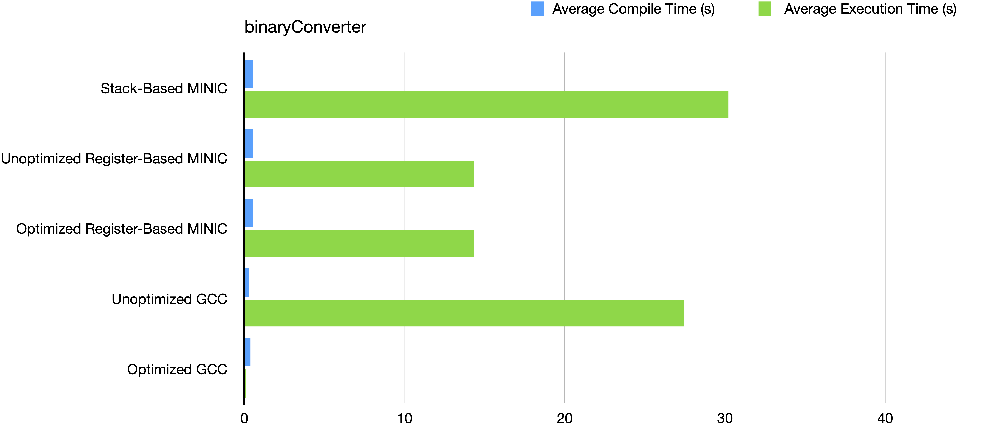

### [brett](./Benchmarks/brett)

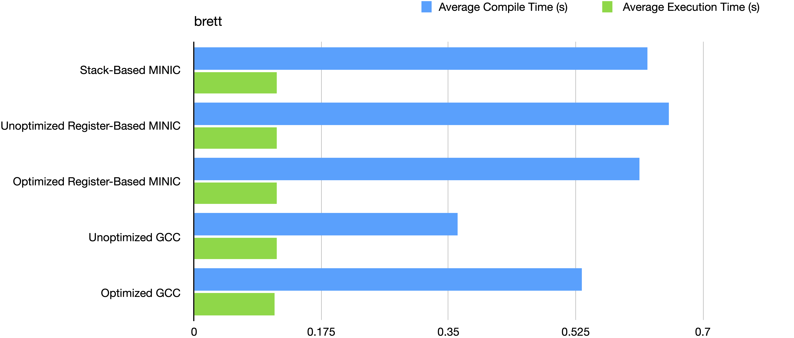

### [creativeBenchMarkName](./Benchmarks/creativeBenchMarkName)

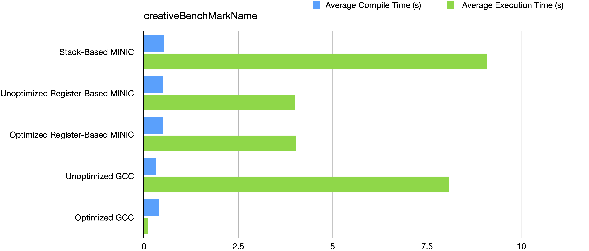

### [fact_sum](./Benchmarks/fact_sum)


### [Fibonacci](./Benchmarks/Fibonacci)


### [GeneralFunctAndOptimize](./Benchmarks/GeneralFunctAndOptimize)

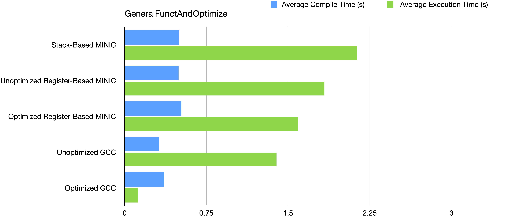

### [hailstone](./Benchmarks/hailstone)

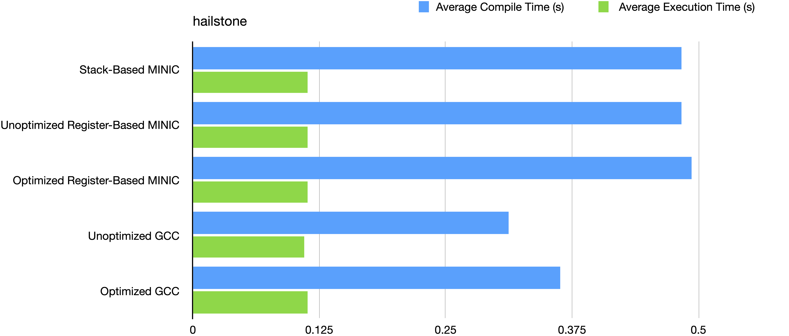

### [hanoi_benchmark](./Benchmarks/hanoi_benchmark)

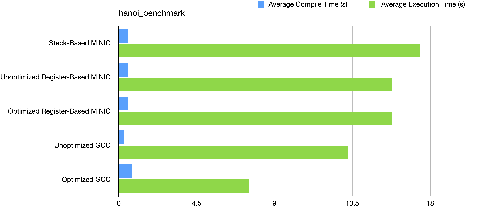

### [killerBubbles](./Benchmarks/killerBubbles)

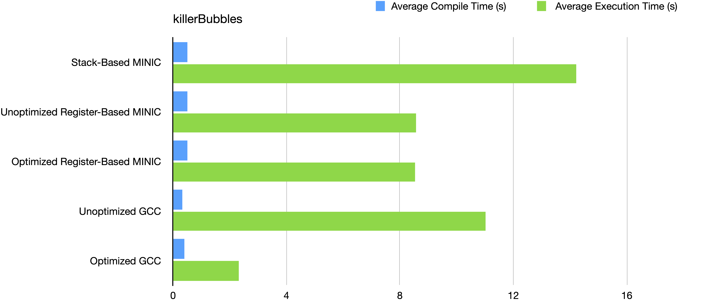

### [mile1](./Benchmarks/mile1)

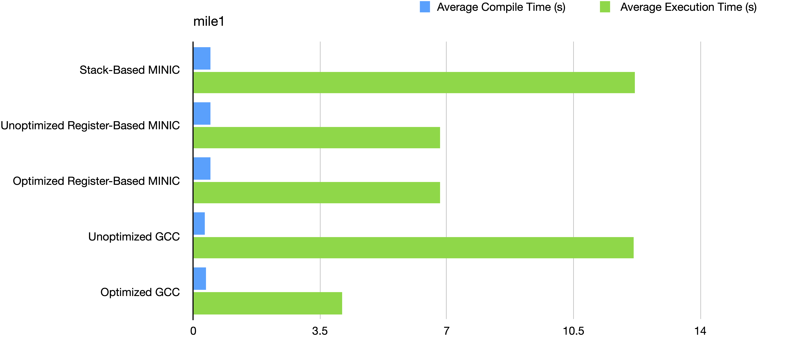

### [mixed](./Benchmarks/mixed)


### [OptimizationBenchmark](./Benchmarks/OptimizationBenchmark)


### [primes](./Benchmarks/primes)

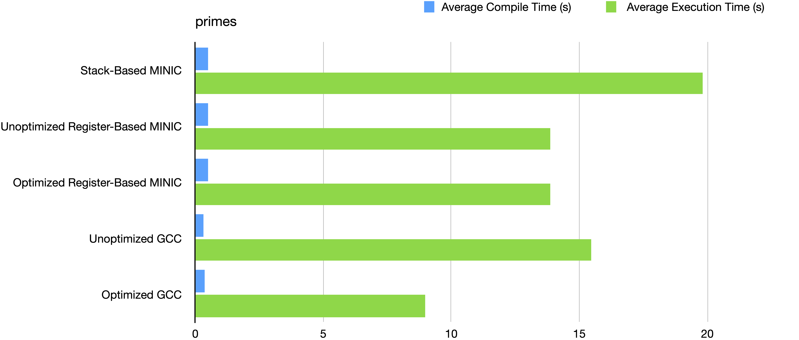

### [programBreaker](./Benchmarks/programBreaker)

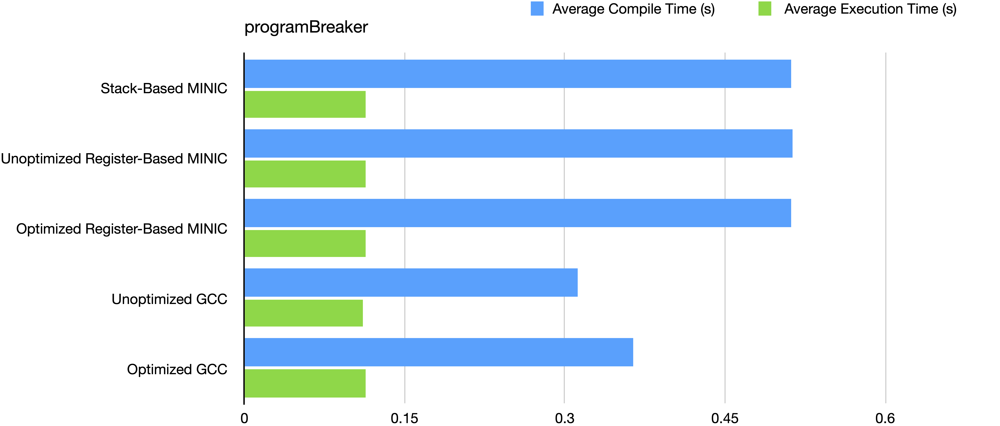

### [stats](./Benchmarks/stats)

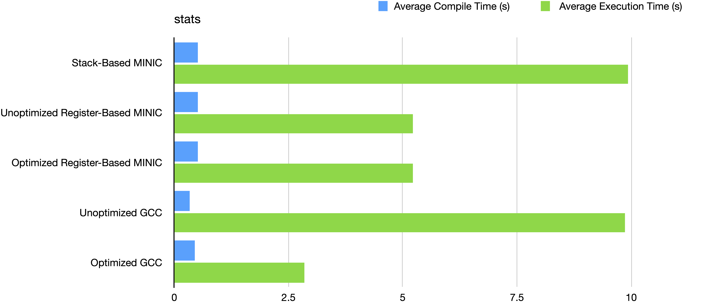

### [TicTac](./Benchmarks/TicTac)

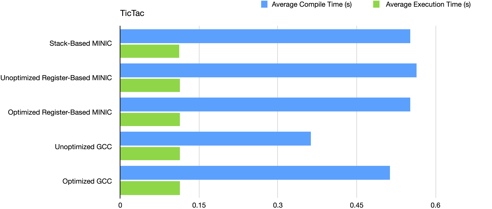

### [wasteOfCycles](./Benchmarks/wasteOfCycles)

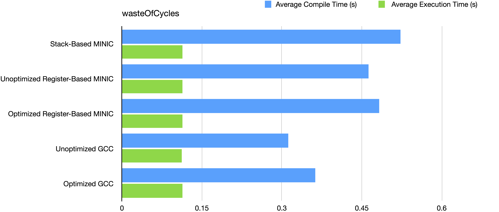

